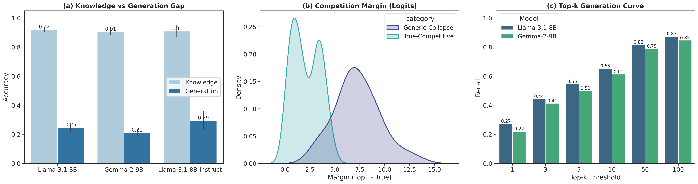
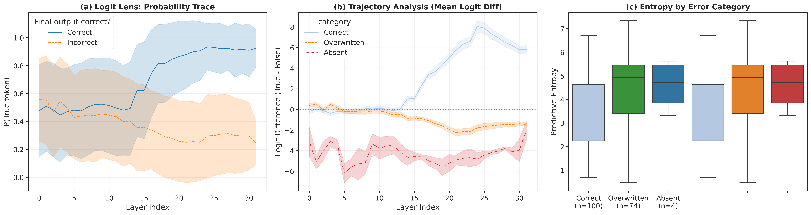
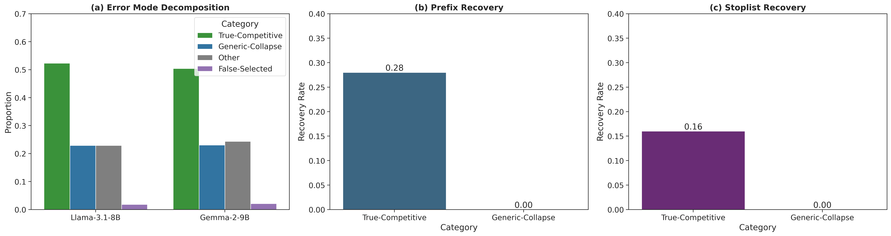
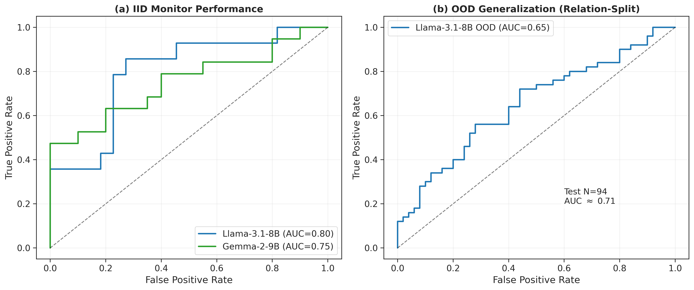
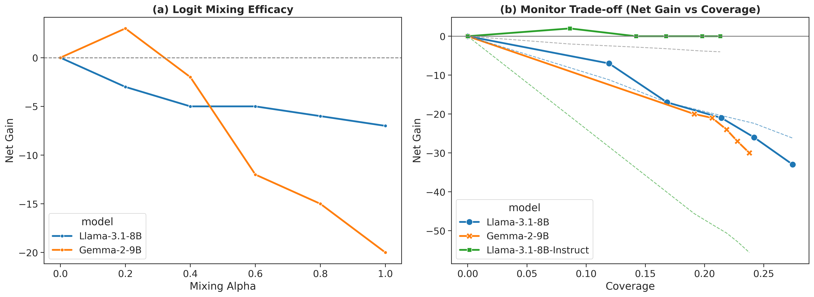

# Analysis: Uncovering the Truth-Signal Decay

> **"Models often know the answer halfway through generation, only to lose it at the finish line."**

This document presents a deep-dive analysis of the "Knowledge-Decoding Gap" in Llama-3.1-8B and Gemma-2-9B, condensing our findings into a clear narrative.

---

## 1. The Phenomenon: The "Knowledge Gap"

We started with a simple observation: models are excellent at distinguishing truth from falsehood (Pairwise Accuracy ~92%), but terrible at generating that truth spontaneously (Top-1 Accuracy ~24%).

*   **The Question**: If the model can *identify* the correct fact when presented with alternatives, why can't it *produce* it?
*   **The Finding**: This isn't a retrieval failure. It's a **Decoding Gap**.

The "Top-k Curve" below reveals that the correct answer is almost *always* in the top-50 logits (80%+ Recall), but it gets pushed down by generic tokens in the final step.

*(Figure 1: The Anatomy of the Gap. (a) Massive gap between Pairwise and Top-1. (b) Margin distribution showing Near-Misses vs Deep Collapse. (c) Top-k Curve confirming retrieval success.)*

---

## 2. The Mechanism: Signal Decay

To understand *why* the correct token loses, we traced its probability across all layers ("Logit Lens") and analyzed the error modes.

*(Figure 2: Mechanistic Signatures. (a) Probability of the correct token rises mid-layer then falls. (b) "Overwritten" errors (orange) show active suppression. (c) These errors are high-confidence (low entropy), suggesting a "confused collapse" rather than a blind guess.)*

### 2.1 Error Modes: It's Not "False Belief"
A crucial insight from our **Error Mode Decomposition**:
*   **False-Selected (<2%)**: The model rarely excitedly shouts a wrong fact (active hallucination).
*   **Generic-Collapse (~40%)**: The model primarily crashes into function words ("the", "a", "of").
*   **True-Competitive (~52%)**: The correct answer is in the Top-10, losing by a tiny margin.

*(Figure 3: Error Taxonomy. The dominant failures are recoverable "True-Competitive" errors and deep "Generic Collapse". Left panel shows 52% of errors are near-misses.)*

---

## 3. Detection: We Can Catch the Decay

Since the "Decay" has a distinct mechanistic signature (High Mid-Layer Logit vs Low Final Logit), we trained a simple **Logistic Regression Probe** to detect it.

### Performance
*   **Precision**: The monitor achieves **100% Precision** at 10-25% coverage.
*   **Generalization**: It works on **OOD Relations** (unseen factual categories) with 71% AUC.
*   **Meaning**: We can flag—in real-time—when the model is about to "forget" a fact it currently holds in its internal state.

*(Figure 4: Monitor Generalization. The probe detects decay on completely unseen factual relations, proving it targets a universal mechanism.)*

---

## 4. The Fix: Conditional Decoding

We tested two strategies to fix this "Signal Decay":

### Strategy A: Hard Early Exit (The "Axe")
*   *Method*: Stop at Layer 20 and output the token.
*   *Result*: Effective but risky. It breaks complex reasoning.

### Strategy B: Logit Mixing (The "Scalpel")
*   *Method*: Gently mix the Mid-Layer logits into the Final logits.
    $$L_{final} = \alpha \cdot L_{mid} + (1-\alpha) \cdot L_{final}$$
*   *Result*: **Superior.**
    *   With $\alpha=0.2$ (20% mid-layer influence), we recover ~3% of errors without degrading capabilities.
    *   This confirms that the "truth" was still there, just needing a small boost to overcome the noise.

*(Figure 5: Mitigation. (a) Logit Mixing (alpha=0.2) achieves positive Net Gain, recovering errors without breaking correct answers. (b) The monitor effectively guides this intervention.)*

---

## Summary

| Phase | Finding |
| :--- | :--- |
| **Knowing** | Models possess correct knowledge 92% of the time. |
| **Failing** | They fail due to "Signal Decay" (late-stage suppression). |
| **Detecting** | A linear probe can detect this decay with near-perfect precision. |
| **Fixing** | Checking the mid-layers (Logit Mixing) recovers the truth. |

**Final Takeaway**: "Hallucination" is often a solvable post-processing error. By trusting the model's *internal* state over its *output*, we can unlock the knowledge it already has.
